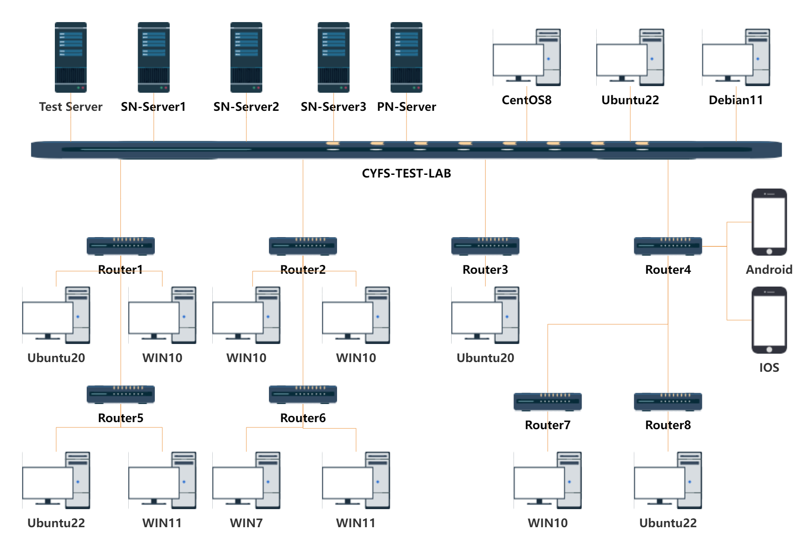
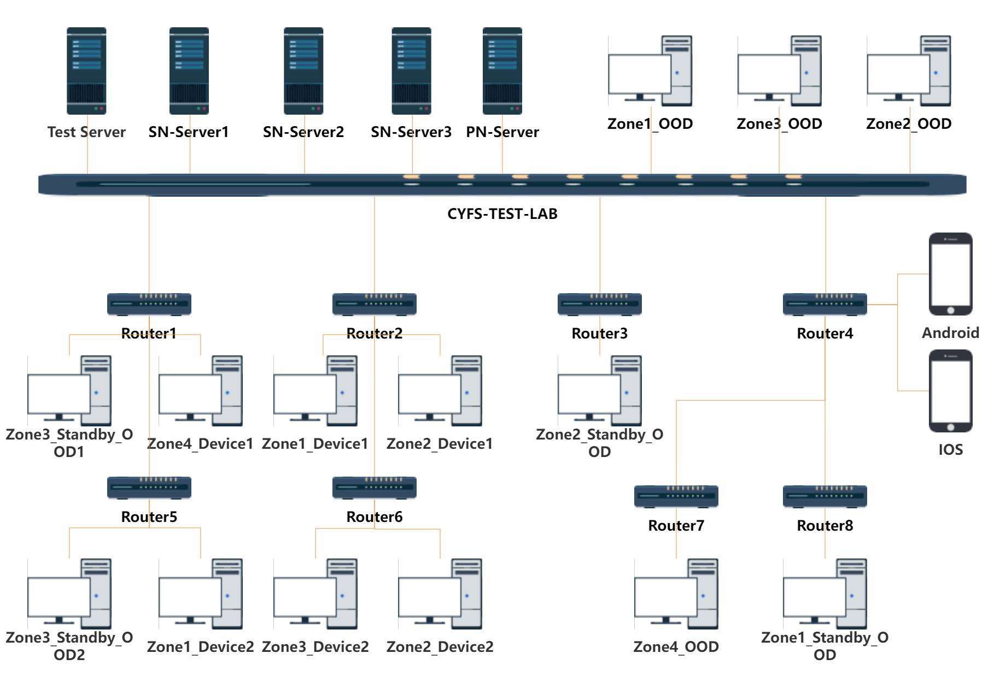

# cyfs-test-lab
cyfs-test-lab is a local physical machine test cluster set up to test CYberFileSystem (CYFS). 
The main purpose of the tests is to verify the correctness and performance of the BDT network protocol and CYFS protocol stack across different operating system platforms and network environments. This test cluster aims to simulate real-world usage scenarios to determine the performance and stability of CYFS under various conditions.

## Testing environment

[You can click view node details](./doc/zh-CN/测试环境/实验室测试机器.md)
### Network environment design

The CYFS protocol mainly relies on the BDT network protocol stack for network communication. The BDT protocol is a P2P network protocol that implements NAT traversal, which allows hosts behind NATs to communicate with each other. Therefore, to test and optimize the performance of data transmission and connectivity in P2P networks using the CYFS protocol, it is necessary to simulate and test in a wide area network environment.

Therefore, we have constructed a multi-layer router structure. To simulate various NAT network environments, we have set up a multi-layer software router structure in cyfs-test-lab. Specifically, we have configured the following routers:

+ CYFS-TEST-LAB: Public 192.168.200.0/24
+ Router1： Full Cone 192.168.1.0/24
+ Router2： Port Restricted Cone 10.1.2.0/24
+ Router3： Symmetric 10.1.1.0/24 
+ Router4： Symmetric 192.168.199.0/24
+ Router5： Full Cone/Port Restricted Cone 192.168.10.0/24
+ Router6： Port Restricted Cone/Full Cone 192.168.1.0/24
+ Router7： Symmetric/Full Cone 192.168.1.0/24
+ Router8： Symmetric/Port Restricted Cone 10.1.1.0/24

In the cyfs-test-lab network environment, other factors are also taken into consideration, including:

+ Setting up an IPv6 network environment to test the compatibility of the BDT protocol with IPv6 networks.
+ Setting up a NAT Port Mapping Protocol environment to verify the good P2P network connectivity of the BDT protocol when using public IPv4 addresses and port mapping.
+ Connecting some machines to multiple networks to test the ability of the BDT protocol to establish better performing tunnels.

These measures are aimed at testing and optimizing the data transmission and connectivity performance of the BDT protocol in various complex network environments.
### Operating system coverage

+ Win7/Win10/Win11
+ Ubuntu20/Ubuntu22/CentOS8/Debian11 
+ IOS/Android/HarmonyOS

### CYFS-Stack Nightly environment

In the CYFS protocol, there is a concept of "Zone", where all devices belonging to one person are grouped into a zone, and permissions are isolated based on the Zone. OOD (Owner Operated Device) is equivalent to the user's personal server, running the DEC APP service side and storing the user's personal data. Devices running CYFS Browser, CYFS Chat, or any client running cyfs-runtime can be used as a Device.

In cyfs-test-lab, we simulated 4 Zones for testing purposes.

## Testing framework

CYFS and BDT are new protocols, so in order to test them, we have designed a series of testing tools.

+ node-tester-server : 
    + HTTP_FILE_SERVER ：Save service package、test log、testcase file,and support downloading
    + agent_master_AgentServer : Implement a TCP proxy service，Provide sending control commands between testing nodes.
    + agent_master_AgentControl ：Implemented a backend management system for the testing framework, which includes creating and executing testing nodes, test cases, testing software packages, testing tasks, viewing test results, and downloading logs.

+ node-tester-web :  Front-end page for the testing framework's backend management system.

+ node-tester-data ：Testing data collection and statistics service.

+ node-tester-app ：Testing framework case execution client, implementing automatic updates for testing software packages and test cases, as well as distributed execution of test cases.
  
+ bdt-utils : To test BDT, a series of stub code and tools were encapsulated to facilitate testing.

+ bdt-unittest : BDT unit test code.

+ bdt-cli ：The simple BDT client written runs in the service of node-tester-app

+ cyfs-driver ：SUpport test CYFS Stack real machine environment and simulator environment

+ cyfs-test-dec-app ：Test dec-app implemented by cyfs-sdk and related test cases of cyfs satck

## Quick start
If you need to build a cyfs-test-lab testing environment, you can refer to the following documentation for setup:

+ cyfs-test-lab machine list: Currently, cyfs-test-lab uses real physical machines to build the testing environment, and Docker testing environment setup method will be provided in the future.
+ cyfs-test-lab Server deploy ：[cyfs-test-lab server build tutorial](./doc/zh-CN/实验室测试框架/ops/cyfs_test_lab服务端部署.md)
+ cyfs-test-lab Client deploy：[cyfs-test-lab agent build tutorial](./doc/zh-CN/实验室测试框架/ops/cyfs_test_lab客户端部署.md)

## Test Methods

+ BDT network protocol testing methods:
  + BDT network protocol unit testing
  + BDT network protocol laboratory testing method
  
+ CYFS Stack testing methods:
  + [CYFS Stack simulator test methods](./doc/zh-CN/CYFS协议栈测试/测试方法/CYFS协议栈模拟器测试方法.md)
  + [CYFS Stack real machine test methods](./doc/zh-CN/CYFS协议栈测试/测试方法/CYFS协议栈在实验室测试方法.md)

## Test case design and implementation

+ [BDT network protocol test case design and implementation](./doc/zh-CN/BDT测试/测试用例/BDT测试用例设计.md)

+ [CYFS Stack test case design and implementation](./doc/zh-CN/CYFS协议栈测试/测试用例/CYFS协议栈测试用例设计.md)

## Test result statistics
+ [cyfs-test-lab](http://bdttest.tinyappcloud.com/) 