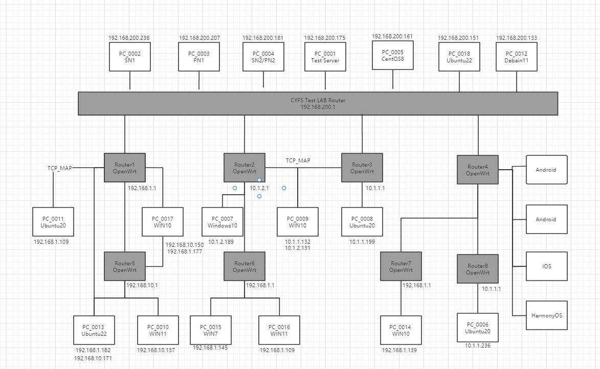

# cyfs-test-lab
cyfs-test-lab 是为了测试 CYberFileSystem(CYFS) 搭建的局域网物理机器测试集群,主要测试BDT网络协议和CYFS协议栈在不同操作系统平台和不同网络环境运行正确性和性能。

## 一、网络拓扑设计
BDT网络拓扑结构：




##  二、硬件环境设计
### （1） NAT网络环境
cyfs-test-lab 主要为了模拟P2P网络中NAT网络环境，搭建多层软路由建立局域网测试环境  
+ Bucky  ： Pubic 192.168.100.0/24
+ Router1： Full Cone 192.168.1.0/24
+ Router2： Port Restricted Cone 192.168.199.0/24
+ Router3： Symmetric 10.10.1.0/24 
+ Router4： Symmetric 192.168.199.0/24
+ Router5： Full Cone/Port Restricted Cone 192.168.10.0/24
+ Router6： Port Restricted Cone/Full Cone 192.168.1.0/24
+ Router7： Symmetric/Full Cone 192.168.1.0/24
+ Router8： Symmetric/Port Restricted Cone 10.1.1.0/24

 在cyfs-test-lab 网络环境中考虑其他的因素
 + 搭建IPv6网络环境，测试BDT协议在IPv6网络兼容性，
 + 搭建了NAT Port Mapping Protocol 环境，验证BDT在协议在使用公网IPv4 地址+端口映射有良好P2P网络连通性
 + 部分机器连接多个网络为了测试BDT能够建立更好性能的Tunnel

### （2）操作系统覆盖
+ 覆盖的操作系统类型：
  + WIN7/WIN10/WIN11
  + Ubuntu20/Ubuntu22/CentOS8/Debian11 
  + Mac(暂未支持)
  + IOS/Android/HarmonyOS
  
## 三、测试设备列表
| 机器名称	  |   功能	                     |  路由器	       | NAT类型	  | IP 					            | 操作系统		          |
| ---------- | ---------------------------   | ---------------- | ---------------------| ----------------------------------------- |--------------|
| PC_0001    |   Test Server	               |  Bucky           | pubic                | 192.168.100.254             		| Ubuntu22                | 
| PC_0002    |   SN1		                     |  Bucky           | pubic                | 192.168.100.22              		| CentOS8.3               | 
| PC_0003    |   PN1		                     |  Bucky           | pubic                | 192.168.100.151             		| Ubuntu20.04             | 
| PC_0004    |   SN2/PN2		                 |  Bucky           | pubic                | 192.168.100.172             		| CentOS8.5               | 
| PC_0005    |   Agent&Zone1_OOD             |  Bucky           | pubic                | 192.168.100.156             		| CentOS8.5               |
| PC_0006    |   Agent&Zone1_Standby_OOD     |  Router8         | Symmetric            | 10.1.1.236             		 	  | Ubuntu 20.04            | 
| PC_0007    |   Agent&Zone1_Device1         |  Router2         | Port Restricted Cone | 192.168.199.189             		| Windows10               | 
| PC_0008    |   Agent&Zone2_Standby_OOD     |  Router3         | Symmetric            | 10.1.1.199             			  | Ubuntu20.04             | 
| PC_0009    |   Agent&Zone2_Device1         |  Router2&Router6 | pubic                | 192.168.199.132/10.1.1.131		  | Windows10               | 
| PC_0010    |   Agent&Zone1_Device2         |  Router5         | Port Restricted Cone | 192.168.10.137              		| Windows11               | 
| PC_0011    |   Agent&Zone3_Standby_OOD1    |  Router1         | Full Cone            | 192.168.1.109             		  | Ubuntu20.04             | 
| PC_0012    |   Agent&Zone3_OOD	           |  Bucky           | pubic                | 192.168.100.132             		| Debian11                |
| PC_0013    |   Agent&Zone3_Standby_OOD2    |  Router1&Router5 | Full Cone            | 192.168.1.182/192.168.10.171		| CentOS8.5               | 
| PC_0014    |   Agent&Zone4_Standalone      |  Router7         | Symmetric            | 192.168.1.139             		  | Windows10               | 
| PC_0015    |   Agent&Zone3_Device2         |  Router6         | Port Restricted Cone | 192.168.1.145             		  | Windows7                |
| PC_0016    |   Agent&Zone2_Device2         |  Router6         | Port Restricted Cone | 192.168.1.142             		  | Windows11               | 
| PC_0017    |   Agent&Zone4_Standalone      |  Router1&Router5 | Full Cone            | 192.168.1.178/192.168.1.177	  | Windows10               | 
| PC_0018    |   Agent&Zone2_OOD             |  Bucky           | pubic                | 192.168.100.36	                | Ubuntu 22.04            | 

## 测试框架服务
 [测试服务部署效果展示： 实验室内网测试环境](http://192.168.100.254/) 


+ node-tester-server : 
    + HTTP_FILE_SERVER ：测试节点软件包service更新、日志上报的文件系统服务，用于测试节点软件包更新，日志上传。
    + agent_master_AgentServer : 实现tcp websocket 代理服务，为测试节点之间命令下发提供网络代理服务。
    + agent_master_AgentControl ：实现的测试框架后台管理系统，实现测试节点、测试用例、测试软件包、测试任务创建执行、测试结果查看、日志下载功能 

+ node-tester-web : 测试框架后台管理系统前端页面

+ node-tester-data ：测试数据收集统计服务

+ node-tester-app ：测试框架执行用例客户端，实现测试软件包和测试用例的自动化更新，以及测试用例的分布式执行。
  
+ bdt-tools ：为了测试BDT网络传输，编写的BDT简易客户端，运行在node-tester-app 的service中

+ cyfs-stack-test-typescript ：CYFS协议栈接口测试用例脚本，主要覆盖CYFS协议栈所有功能模块的测试脚本，用例执行cyfs协议栈模拟器和真实环境两套环境运行

+ cyfs-test-dec-app ： CYFS协议栈编写的测试dec_app


```sequence
  title : Task run sequence
  participant AgentTask
  participant AgentA
  participant AgentB
  participant TestServer
  participant TestServerWeb

  TestServerWeb -> TestServer : node-tester-web 创建一个测试任务
  TestServer -> AgentTask : 选择一个机器去执行测试用例
  AgentTask -> TestServer : AgentTask 通知AgentA进行操作，经过TestServer代理
  TestServer -> AgentA : TestServer AgentServer代理转发操作请求
  AgentA -> AgentA : 启动测试 Service ,进行操作
  AgentA --> TestServer : 返回操作结果
  TestServer --> AgentTask : 代理转发AgentA操作结果
  AgentTask -> TestServer : AgentTask 通知AgentB进行操作，经过TestServer代理
  TestServer -> AgentB : TestServer AgentServer代理转发操作请求
  AgentB -> AgentB : 启动测试 Service ,进行操作
  AgentB --> TestServer : 返回操作结果
  TestServer --> AgentTask : 代理转发AgentB操作结果
  AgentTask -> TestServer : 通知 TestServer agent_master_AgentControl 执行完成，将执行记录上传TestServer node-tester-data  
  TestServer -> AgentA : 执行完成，关闭服务
  AgentA -> TestServer : 执行完成，上报执行日志到TestServer HTTP_FILE_SERVER
  TestServer -> AgentB : 执行完成，关闭服务
  AgentB -> TestServer : 执行完成，上报执行日志到TestServer HTTP_FILE_SERVER
```

```sequence
  title : rust_bdt/cyfs_stack service update sequence 
  participant HTTP_FILE_SERVER
  participant node-tester-web 
  participant node-tester-app
  participant HTTP_FILE_SERVER

  node-tester-web -> node-tester-web : Upload a new version rust_bdt/cyfs_stack service
  node-tester-web -> HTTP_FILE_SERVER : Upload service zip File
  node-tester-app -> node-tester-web : Check version
  node-tester-web --> node-tester-app : Return to the latest version information
  node-tester-app -> HTTP_FILE_SERVER : Download latest version file
```

## 快速搭建
如果你需要搭建cyfs-test-lab测试环境，可以参照以下文档进行搭建：
+ cyfs-test-lab 机器列表 : 目前cyfs-test-lab使用真实的物理机器搭建测试环境，后续将提供Docker测试环境搭建方式
+ cyfs-test-lab 服务端搭建 ：[cyfs-test-lab 服务端搭建教程](./doc/zh-CN/实验室测试框架/ops/cyfs_test_lab服务端部署.md)
+ cyfs-test-lab 客户端搭建 ：[cyfs-test-lab 客户端端搭建教程](./doc/zh-CN/实验室测试框架/ops/cyfs_test_lab客户端部署.md)


## 测试方法

+ BDT网络协议测试方法 :
  + BDT网络协议单元测试
  + BDT网络协议实验室测试方法
  
+ CYFS协议栈测试方法 : 
  + [CYFS协议栈模拟器测试方法](./doc/zh-CN/CYFS协议栈测试/测试方法/CYFS协议栈模拟器测试方法.md)
  + [CYFS协议栈在实验室测试方法](./doc/zh-CN/CYFS协议栈测试/测试方法/CYFS协议栈在实验室测试方法.md)

## 测试用例设计实现

+ [BDT网络协议测试用例设计实现](./doc/zh-CN/BDT测试/测试用例/BDT测试用例设计.md)

+ [CYFS协议栈测试用例设计实现](./doc/zh-CN/CYFS协议栈测试/测试用例/CYFS协议栈测试用例设计.md)

## 测试结果统计
+ [实验室内网测试环境](http://192.168.100.254/) 