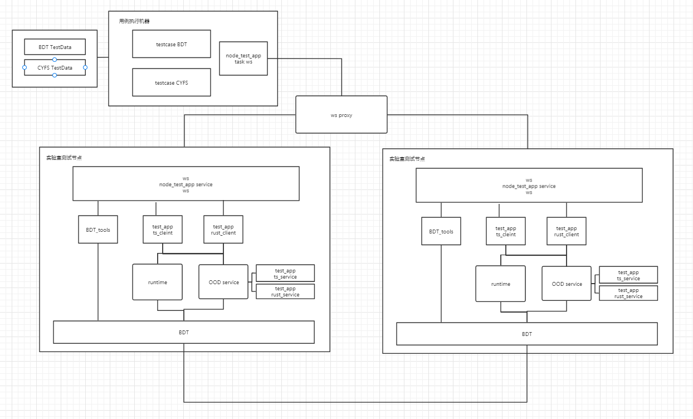
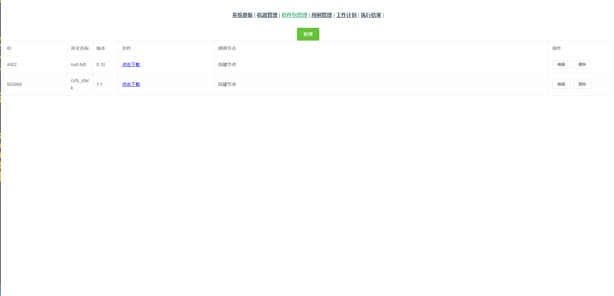
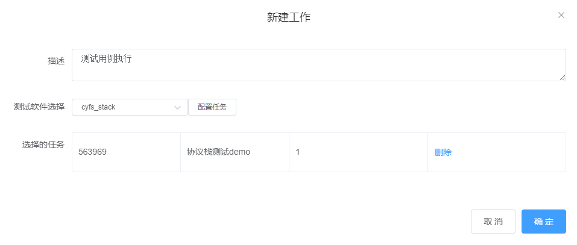
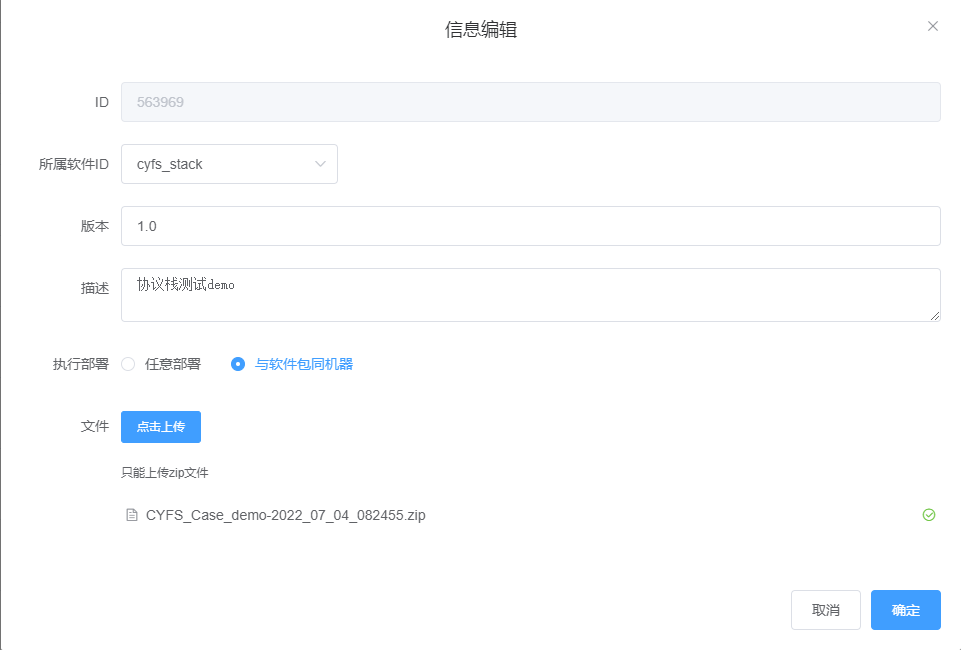

# CYFS协议栈实验室测试
    CYFS 协议栈测试在非模拟器环境运行，需要在多台NAT环境下机器控制执行测试，整体的测试基本使用和BDT相同测试框架，以下是整理的测试流程

## 测试用例流程说明

测试框架各模块说明：

+ node_tester_app task : 测试框架中的测试用例，通过测试框架连接各测试节点，其他测试服务进行操作，并且统计测试用例执行的结果。
+ node_tester_app service : 注册一个测试服务，将接收到测试框架的接口请求转发到被测的测试客户端。
+ node_tester_server：测试框架web socket服务器，用来转发测试节点间的请求；测试框架的后台接口。
+ node_tester_web：测试框架的VUE页面。
+ node_tester_service：保存测试数据的http服务器;
+ 测试程序客户端： bdt_client/ts_client/cyfs_test_app

测试用例执行流程：
+ （1）在测试框架管理页面node_tester_web上传测试的service/task,配置task 执行任务
+ （2）测试用例task 通过测试框架启动service，将测试执行请求通过接口形式发送到service
+ （3）测试节点的service连接测试节点被测程序的客户端执行相应的操作，将执行结果返回service，service返回task
+ （4）task 统计各个测试操作的执行结果，将测试数据汇总保存到node_tester_service和测试框架

## CYFS协议栈测试流程说明

### 测试用例：node_tester_app task

* (1)测试用例数据
``` typescript
// cyfs_stack2\src\node_tester_app\tasks\CYFS_Case_demo\onload.ts
export async function TaskMain(_interface: TaskClientInterface) {
    // 测试用例demo说明: NFT2 机器使用CYFS协议栈ts_client 进行put_object 并且 get_object 检查数据操作，共执行100次，同时并发执行任务数10；
    
    // 测试节点
    let agentList:Array<Agent> = [
        {
            name : "NFT2", //名称标签
            cyfs_clients : [{
                name:"NFT2_ts_client", //   模拟协议栈 ${Agent.name}_0 、${Agent.name}_1 这样编号
                type:"runtime", //协议栈client 连接类型 runtime 、ood 、port
                SDK_type:"typescript",
            }],
            logType : "info", // 日志级别控制
            report : true, //报错cyfs库的性能数据
            report_time:10*1000, //间隔时间

        }
    ]
    // 测试用例执行的任务集合Task 和单个操作Action
    let taskList:Array<Task> = []
    for(let i =0;i<100;i++){
        taskList.push({
            LN : {name:"NFT2_ts_client"}, 
            RN : {name:"NFT2_ts_client"},  // remote
            clients : [],
            timeout : 100*1000, //超时时间
            action:[{
                type : "put_object_check",
                source : "NFT2_ts_client",
                target : "NFT2_ts_client",
                timeout : 100*1000,
                input_data : {
                    obj_type : CustumObjectType.MyText,
                    common : {
                        level: "router",
                        target: "NFT2_ts_client",
                        flags : 0
        
                    }
                },
                expect:{err:0,log:"run success"},
            }],
            expect:{err:0,log:"run success"},
        })
    }
    let testRunner = new TestRunner(_interface);
    //测试用例数据
    let testcase:Testcase = {
        TestcaseName:'NON_put_object',
        testcaseId : `NON_put_object_${Date.now()}`,
        remark : "测试NON put_object操作100次，并发数10 操作流程 （1）A put object B (2)B get object Noc check",
        environment : "lab",
        test_date :  date.format(new Date(),'YYYY/MM/DD'),
        agentList,
        taskList,
        taskMult:10
    }
    _interface.getLogger().info(JSON.stringify(testcase))
    //测试用例执行
    await testRunner.testCaseRunner(testcase);
}

```
* (2)测试用例执行器
```typescript
// cyfs_stack2\src\node_tester_app\taskTools\cyfs_stack\stackRunner.ts
export class TestRunner extends EventEmitter{
    async testCaseRunner(testcase:Testcase) //测试用例执行
    async exitTestcase(result:number,log:string) //测试用例退出
    async connectAgent() //连接测试框架节点
    async initCyfsPeer() //启动测试节点 测试客户端
    async saveTestcaseToMysql() //保存测试执行结果到http 服务器，mysql表中便于统计
    async put_object_check(task:number,action:number) // 测试用例action封装
}
```
* (3)测试用例中连接测试框架发起操作请求封装
``` typescript
// cyfs_stack2\src\node_tester_app\taskTools\cyfs_stack\stackTool.ts
export class StackPeer extends EventEmitter{
    constructor(options: {agentid: string;_interface: TaskClientInterface;timeout: number;tags : string;}) //实例化一个测试节点对象
    async start_client //启动测试节点 被测程序客户端
    async open_stack // 被测程序客户端连接CYFS协议栈
    async put_object //put_object 发送请求->测试service ->测试客户端-> CYFS协议栈 
    async get_object //get_object 发送请求->测试service ->测试客户端-> CYFS协议栈 
    async destoryPeer // 测试节点关闭测试服务
}

export class StackPeerProxy{
    //测试节点对象管理
    newPeer(agentid: string,tags:string): StackPeer // 新增一个测试节点对象
    getPeer(name:string):{err:ErrorCode,peer?:StackPeer} //通过名称获取测试节点对象
    async exit(type:string='finish') //所有测试节点退出
}
```

### 测试用例：node_tester_app service

* (1)测试服务接口注册
```typescript
 // cyfs_stack2\src\node_tester_app\service\cyfs_stack\onload.ts
 export async function ServiceMain(_interface: ServiceClientInterface) {
    // 测试service 实例化
    let manager: StackManager = StackManager.createInstance(_interface.getLogger(), _interface.getPlatform());
    await manager.init();
     // 测试服务注册接口，启动cyfs_client
     _interface.registerApi('start_client', async (from: Namespace, bytes: Buffer, param: {stack_type: string, SDK_type: string, log_type?: string})
     // 测试服务注册接口，控制cyfs_client 连接协议栈
    _interface.registerApi('open_stack', async (from: Namespace, bytes: Buffer, param: {peerName:string,stack_type:string,dec_id?:string,http_port?:number,ws_port?:number})
    // 测试服务注册接口，控制cyfs_client put_obejct
    _interface.registerApi('put_obejct', async (from: Namespace, bytes: Buffer, param: {peerName: string, obj_type: number, put_object_params: WSParams.PutObjectParmas})
    // 测试服务注册接口，控制cyfs_client get_obejct
    _interface.registerApi('get_obejct', async (from: Namespace, bytes: Buffer, param: {peerName:string,obj_type:number,get_object_params:WSParams.GetObjectParmas})
    // 测试服务退出，释放本地所有测试客户端
    _interface.registerApi('destoryPeer', async (from: Namespace, bytes: Buffer, param: {peerName: string})
 }
``` 
* (2)测试服务接收请求分发各测试客户端
``` typescript
export class StackManager extends EventEmitter{
    private m_peers: Map<string, PeerInfo>; // 缓存各测试客户端
    // 初始化不同类型客户端
    async start_client(stack_type:string,SDK_type:string,log_type:string = 'trace'): Promise<{err: ErrorCode, peerName?: string,log?:string}> {
        let peerName = `${SDK_type}_${SDK_type}_${RandomGenerator.string(5)}`;

        this.m_logger.info(`current os type ${os.arch()},begin start_client ,stack_type =${stack_type},SDK_type = ${SDK_type},log_type=${log_type}`)

        if(SDK_type=="typescript"){
            // TS 直接进行操作
            let ts_stack = new StackClient({name:peerName,logger:this.m_logger});
            this.m_peers.set(peerName, {type:stack_type,lanuage:SDK_type,ts_stack});

        }else if(SDK_type=="rust"){
            // 启动 ws 服务进行操作
            let exefile = path.join(__dirname,"rust_client.exe")
            let sub = ChildProcess.spawn(`${path.join(SysProcess.cwd(), exefile)}`, [this.m_localServerPort.toString(), peerName, this.m_logger.dir()], {stdio: 'ignore', cwd: SysProcess.cwd(), detached: true, windowsHide: true,env:{}});
            sub.unref();
            this.m_lpcStatus = true;
        }
        return {err:ErrorCode.succ,peerName,log:"open stack success"}
    }
    // 将请求转发不同测试客户端
    async put_obejct(peerName:string,obj_type:number,put_object_params:WSParams.PutObjectParmas): Promise<WSParams.PutObjectResp>{
        if (!this.m_peers.has(peerName)) {
            return {err: ErrorCode.notExist};
        }
        if(this.m_peers.get(peerName)!.ts_stack){
            let stack_client = this.m_peers.get(peerName)!.ts_stack!;
            let result = await stack_client.put_obejct(obj_type,put_object_params)
            return result
        } else if(this.m_peers.get(peerName)!.ws_stack){
            let stack_client = this.m_peers.get(peerName)!.ws_stack!
            let result = await stack_client.put_obejct(obj_type,put_object_params)
            return result
        }else{
            return {err: ErrorCode.notExist,log:"stack client must be inited"};
        }
    }
}
```
* (3)测试请求分发各客户端 web sokect收发包控制
``` typescript
// cyfs_stack2\src\node_tester_app\service\cyfs_stack\stack_ws.ts
// 一个web socket 服务，和本地的测试客户端通讯，进行转发请求
export class StackPeer extends EventEmitter
```
* (4)web sokect 收发包编解码
```typescript
//cyfs_stack2\src\node_tester_app\service\cyfs_stack\lpc.ts
//web socket 服务收发包封装
export class StackLpc extends EventEmitter {
```
### 测试客户端
ts_cleint
```typescript
// cyfs_stack2\src\node_tester_app\service\cyfs_stack\typescript\stack_client.ts
export class StackClient extends EventEmitter{
    private m_stack?:cyfs.SharedCyfsStack;
    async open_stack // 客户端连接本地CYFS协议栈 
    async get_obejct //模拟客户端get object 操作
    // 例如 模拟客户端put object 操作
    async put_obejct(obj_type:number,put_object_params:WSParams.PutObjectParmas): Promise<WSParams.PutObjectResp>{
        
        let object : cyfs.NONObjectInfo
        // 构造要 put obeject的类型
        if(obj_type == CustumObjectType.MyText){
            const obj = cyfs.TextObject.create(cyfs.Some( cyfs.ObjectId.from_base_58(this.m_deviceId!).unwrap()), 'question_saveAndResponse', `test_header, time = ${Date.now()}`, `hello! time = ${Date.now()}`);
            object = new cyfs.NONObjectInfo(obj.calculate_id(), obj.to_vec().unwrap())
        }else{
            // default type
            const obj = cyfs.TextObject.create(cyfs.Some( cyfs.ObjectId.from_base_58(this.m_deviceId!).unwrap()), 'question_saveAndResponse', `test_header, time = ${Date.now()}`, `hello! time = ${Date.now()}`);
            object = new cyfs.NONObjectInfo(obj.calculate_id(), obj.to_vec().unwrap())
        }
        let req: cyfs.NONPutObjectOutputRequest = {
            object:object!,
            common : {
                level:   put_object_params.common.level,
                flags: put_object_params.common.flags,
            } 
        }
        // put object可选参数传入
        if(put_object_params.common.req_path){
            req.common.req_path = put_object_params.common.req_path
        }
        if(put_object_params.common.dec_id){
            req.common.dec_id =  cyfs.ObjectId.from_base_58(put_object_params.common.dec_id!).unwrap()    
        }
        if(put_object_params.common.target){
            req.common.dec_id =  cyfs.ObjectId.from_base_58(put_object_params.common.target!).unwrap()    
        }
        // 调用协议栈put object
        let start_time = Date.now();
        let put_resp = await this.m_stack!.non_service().put_object(req);
        let opt_time = Date.now()-start_time; // 统计操作时间
        if(put_resp.err){
            console.info(`put object failed,err = ${JSON.stringify(put_resp)}`)
            return {err:ErrorCode.fail,log:`${JSON.stringify(put_resp)}`}
        }
        let data_size = object.object_raw.buffer.byteLength;
        return{
            err: ErrorCode.succ,
            log: `put object success`,
            object_id: object!.object_id.to_base_58(),
            object_raw: object.object_raw,
            opt_time,
            data_size
        }
    }
    
}
```
### 测试用例数据保存服务
测试用例执行数据保存服务是 express+prisma+mysql编写

* 测试数据接口：cyfs_stack2\src\node_tester_service\routes\cyfs
* 测试数据Mysql操作：cyfs_stack2\src\node_tester_service\model\cyfs
* mysql中保存的数据
``` SQL

DROP TABLE IF EXISTS `cyfs_testcase`;
CREATE TABLE `cyfs_testcase`  (
  `id` int(11) NOT NULL AUTO_INCREMENT,
  `testcaseId` varchar(255) CHARACTER SET utf8 COLLATE utf8_general_ci NULL DEFAULT NULL COMMENT '测试用例ID',
  `TestcaseName` varchar(255) CHARACTER SET utf8 COLLATE utf8_general_ci NULL DEFAULT NULL COMMENT '测试用例名称',
  `remark` varchar(255) CHARACTER SET utf8 COLLATE utf8_general_ci NULL DEFAULT NULL COMMENT '操作步骤',
  `agentList` text CHARACTER SET utf8 COLLATE utf8_general_ci NULL COMMENT '测试节点列表',
  `taskList` text CHARACTER SET utf8 COLLATE utf8_general_ci NULL COMMENT '测试操作任务列表',
  `environment` varchar(255) CHARACTER SET utf8 COLLATE utf8_general_ci NULL DEFAULT NULL COMMENT '测试环境',
  `taskMult` varchar(255) CHARACTER SET utf8 COLLATE utf8_general_ci NULL DEFAULT NULL COMMENT '测试任务最大并发数量',
	`success` int(11)  NULL DEFAULT NULL COMMENT '测试任务执行成功数量',
	`failed` int(11)  NULL DEFAULT NULL COMMENT '测试任务执行失败数量',
  `result` varchar(255) CHARACTER SET utf8 COLLATE utf8_general_ci NULL DEFAULT NULL COMMENT '测试执行结果',
  `errorList` text CHARACTER SET utf8 COLLATE utf8_general_ci NULL COMMENT '测试任务错误列表',
	`test_date` varchar(255) CHARACTER SET utf8 COLLATE utf8_general_ci NULL DEFAULT NULL COMMENT '执行日期',
	`createTime` varchar(255) CHARACTER SET utf8 COLLATE utf8_general_ci NULL DEFAULT NULL COMMENT '创建时间',
  PRIMARY KEY (`id`) USING BTREE
) ENGINE = InnoDB AUTO_INCREMENT = 28 CHARACTER SET = utf8 COLLATE = utf8_general_ci ROW_FORMAT = Dynamic;


DROP TABLE IF EXISTS `cyfs_task`;
CREATE TABLE `cyfs_task`  (
  `task_id` varchar(255) CHARACTER SET utf8 COLLATE utf8_general_ci NOT NULL COMMENT '测试任务ID',
  `testcaseId` varchar(255) CHARACTER SET utf8 COLLATE utf8_general_ci NULL DEFAULT NULL COMMENT '测试用例ID',
  `LN` varchar(255) CHARACTER SET utf8 COLLATE utf8_general_ci NULL DEFAULT NULL COMMENT '测试任务执行LN设备',
  `RN` varchar(255) CHARACTER SET utf8 COLLATE utf8_general_ci NULL DEFAULT NULL COMMENT '测试任务执行RN设备',
	`clients` text CHARACTER SET utf8 COLLATE utf8_general_ci NULL COMMENT '执行任务执行其他设备',
  `action` text CHARACTER SET utf8 COLLATE utf8_general_ci NULL COMMENT '测试任务执行的操作集合',
	`child_action` text CHARACTER SET utf8 COLLATE utf8_general_ci NULL COMMENT '测试任务执行的操作集合',
	`expect` text CHARACTER SET utf8 COLLATE utf8_general_ci NULL COMMENT '测试任务预期结果',
  `result` text CHARACTER SET utf8 COLLATE utf8_general_ci NULL COMMENT '测试任务实际结果',
	`state` varchar(255) CHARACTER SET utf8 COLLATE utf8_general_ci NULL DEFAULT NULL COMMENT '测试任务状态' ,
	`timeout` int(11) NULL DEFAULT NULL COMMENT '超时时间设置' ,
  `createTime` varchar(255) CHARACTER SET utf8 COLLATE utf8_general_ci NULL DEFAULT NULL COMMENT '创建时间',
  PRIMARY KEY (`task_id`) USING BTREE
) ENGINE = InnoDB CHARACTER SET = utf8 COLLATE = utf8_general_ci ROW_FORMAT = Dynamic;

DROP TABLE IF EXISTS `cyfs_action`;
CREATE TABLE `cyfs_action`  (
  `id` int(11) NOT NULL AUTO_INCREMENT,
  `testcaseId` varchar(255) CHARACTER SET utf8 COLLATE utf8_general_ci NULL DEFAULT NULL COMMENT '测试用例ID',
  `task_id` varchar(255) CHARACTER SET utf8 COLLATE utf8_general_ci NULL DEFAULT NULL COMMENT '测试任务ID',
	`action_id` varchar(255) CHARACTER SET utf8 COLLATE utf8_general_ci NULL DEFAULT NULL  COMMENT '测试操作ID',
	`parent_action` varchar(255) CHARACTER SET utf8 COLLATE utf8_general_ci NULL DEFAULT NULL  COMMENT '测试父操作ID',
  `type` varchar(255) CHARACTER SET utf8 COLLATE utf8_general_ci NULL DEFAULT NULL  COMMENT '操作类型',
	`source` varchar(255) CHARACTER SET utf8 COLLATE utf8_general_ci NULL DEFAULT NULL COMMENT '操作源设备',
	`target` varchar(255) CHARACTER SET utf8 COLLATE utf8_general_ci NULL DEFAULT NULL COMMENT '操作目标设备',
	`input_data` text CHARACTER SET utf8 COLLATE utf8_general_ci NULL COMMENT '输入数据',
  `timeout` int(11) NULL DEFAULT NULL  COMMENT '操作超时时间设置',
  `data_size` double NULL DEFAULT NULL  COMMENT '操作数据大小',
  `opt_time` double NULL DEFAULT NULL  COMMENT '操作时间',
	`cache_size` double NULL DEFAULT NULL  COMMENT '操作节点数据缓存大小',
  `result` varchar(255) CHARACTER SET utf8 COLLATE utf8_general_ci NULL DEFAULT NULL COMMENT '实际结果' ,
  `expect` varchar(255) CHARACTER SET utf8 COLLATE utf8_general_ci NULL DEFAULT NULL COMMENT '预期结果' ,
  `createTime` varchar(255) CHARACTER SET utf8 COLLATE utf8_general_ci NULL DEFAULT NULL,
  PRIMARY KEY (`id`) USING BTREE
) ENGINE = InnoDB AUTO_INCREMENT = 2823 CHARACTER SET = utf8 COLLATE = utf8_general_ci ROW_FORMAT = Dynamic;

```

### 测试VUE页面
    测试VUE页面：http://autotest.ui.com/
*  上传测试用例service



*  上传测试用例task



*  配置执行测试任务



*  执行测试任务


### cyfs_test_app
ts版本实现测试dec_app的server ：cyfs_stack2\src\cyfs_test_app

### 其他语言客户端测试
TODO:
* rust_client rust 版本客户端的封装
* rust_service rust 版本实现测试dec_app的service
* zone-stack 用rust 编写一个模拟器模拟Zone所有的设备,且上链，性能测试可能需要