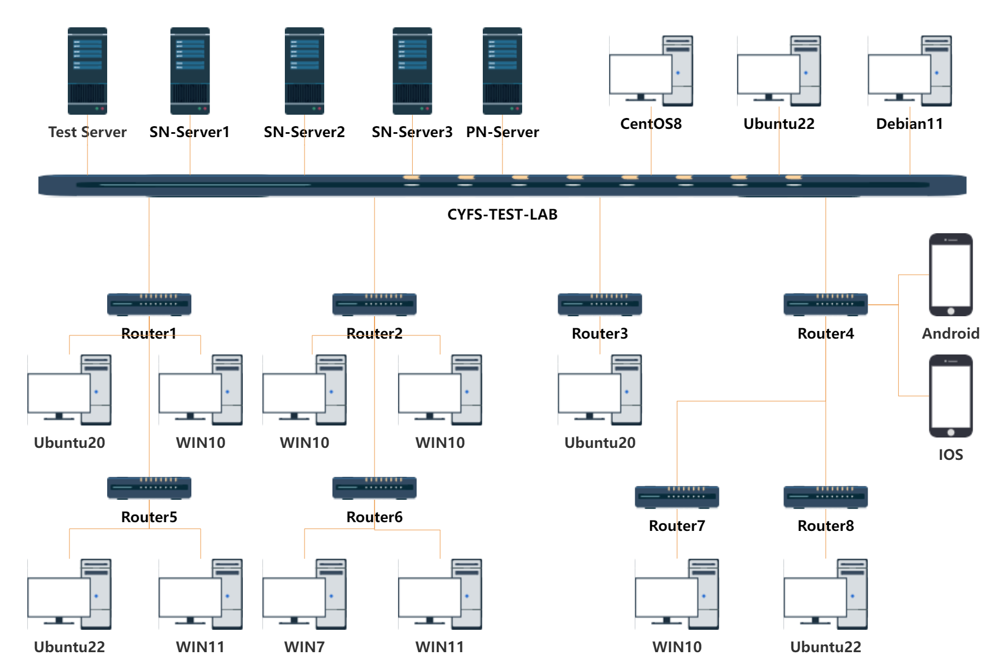
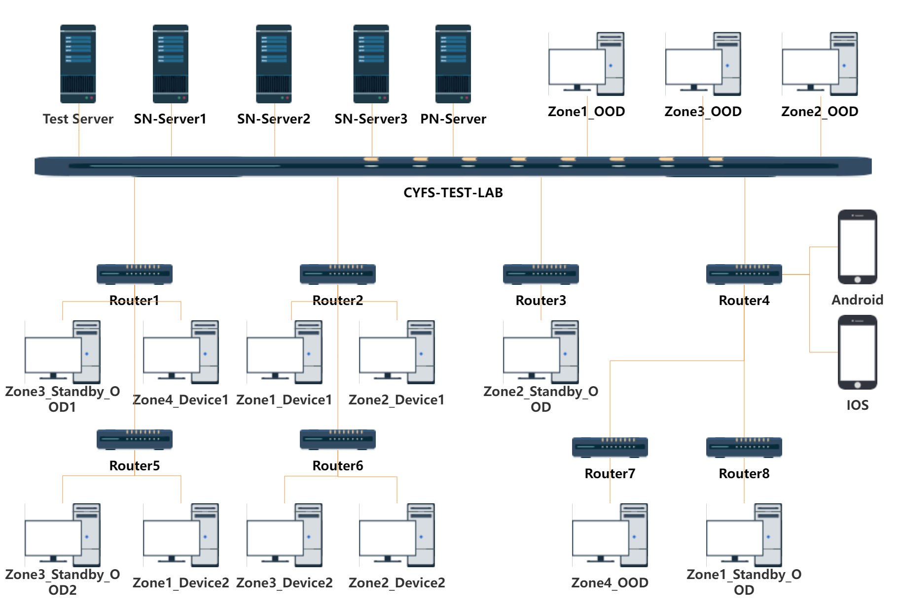

# cyfs-test-lab
cyfs-test-lab 是为了测试 CYberFileSystem(CYFS) 搭建的测试集群,搭建广域网环境测试BDT网络协议的连通性和传输性能,以及部署CYFS-OOD 和 CYFS-Broswer 测试CYFS Stack的功能和性能. 

## 实验室测试环境设计

### （1） NAT网络环境

CYFS 协议主要基于BDT 网络协议栈进行网络通讯，BDT协议一个P2P网络协议，实现了NAT穿透的功能，因此我们需要搭建一个广域网进行模拟测试。

因此我们构造了多层的路由器结构：

+ CYFS-TEST-LAB: Public 192.168.200.0/24
+ Router1： Full Cone 192.168.1.0/24
+ Router2： Port Restricted Cone 10.1.2.0/24
+ Router3： Symmetric 10.1.1.0/24 
+ Router4： Symmetric 192.168.199.0/24
+ Router5： Full Cone/Port Restricted Cone 192.168.10.0/24
+ Router6： Port Restricted Cone/Full Cone 192.168.1.0/24
+ Router7： Symmetric/Full Cone 192.168.1.0/24
+ Router8： Symmetric/Port Restricted Cone 10.1.1.0/24

 在cyfs-test-lab 网络环境中考虑其他的因素
 
 + 搭建IPv6网络环境，测试BDT协议在IPv6网络兼容性，
 + 搭建了NAT Port Mapping Protocol 环境，验证BDT在协议在使用公网IPv4 地址+端口映射有良好P2P网络连通性
 + 部分机器连接多个网络为了测试BDT能够建立更好性能的Tunnel

### （2）操作系统覆盖
+ 覆盖的操作系统类型：
  + WIN7/WIN10/WIN11
  + Ubuntu20/Ubuntu22/CentOS8/Debian11 
  + IOS/Android/HarmonyOS

具体的测试节点信息：[节点详细信息](./测试环境/实验室测试机器.md)

### CYFS-Stack Nightly测试环境

在CYFS协议中有Zone的概念,我们把一个People所有的设备归属于一个Zone，同时基于Zone 对设备做了权限隔离。OOD 相当于用户的个人服务器，运行DEC APP的Service 端,保存用户的个人数据，Device运行的可以是CYFS Broswer、CYFS Chat 等任何运行cyfs-runtime的客户端。

在cyfs test lab 中我们模拟了四个Zone 进行测试。

## 测试框架服务

CYFS 和 BDT由于是一个全新的网络协议,为了进行测试我们设计了一系列的测试工具：

+ node-tester-server : 
    + HTTP_FILE_SERVER ：测试节点软件包service更新、日志上报的文件系统服务，用于测试节点软件包更新，日志上传。
    + agent_master_AgentServer : 实现tcp websocket 代理服务，为测试节点之间命令下发提供网络代理服务。
    + agent_master_AgentControl ：实现的测试框架后台管理系统，实现测试节点、测试用例、测试软件包、测试任务创建执行、测试结果查看、日志下载功能 

+ node-tester-web : 测试框架后台管理系统前端页面

+ node-tester-data ：测试数据收集统计服务

+ node-tester-app ：测试框架执行用例客户端，实现测试软件包和测试用例的自动化更新，以及测试用例的分布式执行。
  
+ bdt-utils : 为了测试BDT 封装的一系类桩代码和工具，方便进行测试

+ bdt-unittest : BDT 单元测试代码 

+ bdt-cli ：为了测试BDT网络传输，编写的BDT简易客户端，运行在node-tester-app 的service中

+ cyfs-driver ：为了测试CYFS Stack 真机环境和模拟器环境实现的测试驱动

+ cyfs-test-dec-app ： cyfs-sdk实现的测试dec-app 以及 cyfs satck 相关测试用例

## 快速搭建
如果你需要搭建cyfs-test-lab测试环境，可以参照以下文档进行搭建：
+ cyfs-test-lab 机器列表 : 目前cyfs-test-lab使用真实的物理机器搭建测试环境，后续将提供Docker测试环境搭建方式
+ cyfs-test-lab 服务端搭建 ：[cyfs-test-lab 服务端搭建教程](./doc/zh-CN/实验室测试框架/ops/cyfs_test_lab服务端部署.md)
+ cyfs-test-lab 客户端搭建 ：[cyfs-test-lab 客户端端搭建教程](./doc/zh-CN/实验室测试框架/ops/cyfs_test_lab客户端部署.md)

## 测试方法

+ BDT网络协议测试方法 :
  + BDT网络协议单元测试
  + BDT网络协议实验室测试方法
  
+ CYFS协议栈测试方法 : 
  + [CYFS协议栈模拟器测试方法](./doc/zh-CN/CYFS协议栈测试/测试方法/CYFS协议栈模拟器测试方法.md)
  + [CYFS协议栈在实验室测试方法](./doc/zh-CN/CYFS协议栈测试/测试方法/CYFS协议栈在实验室测试方法.md)

## 测试用例设计实现

+ [BDT网络协议测试用例设计实现](./doc/zh-CN/BDT测试/测试用例/BDT测试用例设计.md)

+ [CYFS协议栈测试用例设计实现](./doc/zh-CN/CYFS协议栈测试/测试用例/CYFS协议栈测试用例设计.md)

## 测试结果统计
+ [实验室内网测试环境](http://bdttest.tinyappcloud.com/) 