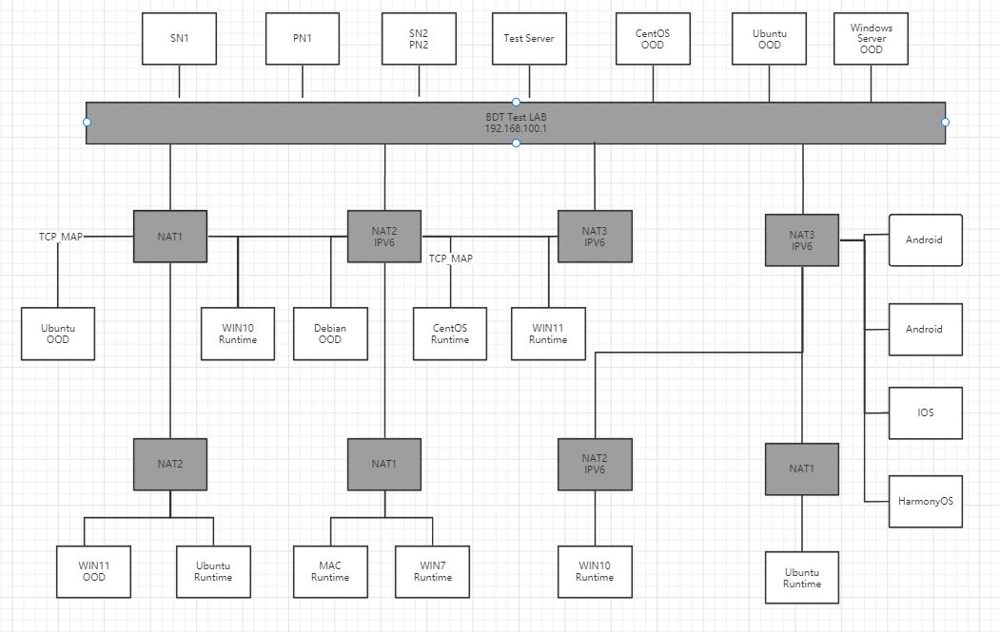
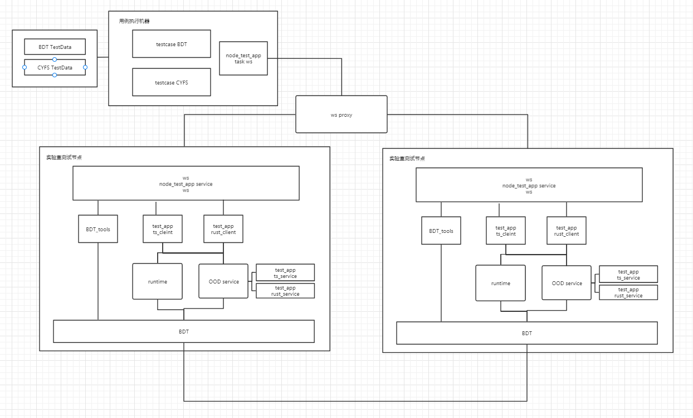

## 实验室网络拓扑设计

##  一、实验室硬件环境设计
### （1） NAT网络环境
 NAT网络环境主要针对不同NAT类型，多层NAT环境设计路由器网络结构：   
+ 交换机 ：  公网(Bucky) 192.168.100.0/24
+ 路由器1： NAT1 192.168.1.0/24
+ 路由器2： NAT2 192.168.199.0/24
+ 路由器3： NAT3 192.168.199.0/24
+ 路由器4： NAT3 10.10.1.0/24
+ 路由器5： NAT1/NAT2 192.168.10.0/24
+ 路由器6： NAT2/NAT1 192.168.1.0/24
+ 路由器7： NAT3/NAT1 192.168.1.0/24
+ 路由器8： NAT3/NAT2 10.1.1.0/24

需要支持其他点：
+ IPV4/IPV6 DHCP
+ IPv4 端口映射
+ WIFI 4/5/6 三种协议 

### （2）操作系统覆盖
+ 覆盖的操作系统类型：
  + WIN7/WIN10/WIN11/WIN server
  + Ubuntu/CentOS/Debian 
  + Mac
  + IOS/Android/HarmonyOS
  
目前cyfs ts-sdk 支持nodejs版本为nodejs14.X +，当前nodejs在WIN7上只支持node12.X

+ 32位/64位
目前cyfs不支持32位系统编译

##  二、实验室软件环境设计
（1）node_test_app 测试框架
+ node_tester_server :  一个ws服务器，转发测试节点间的ws请求，控制测试用例请求发送；提供测试包更新服务；一个Vue管理页面；日志文件服务；
+ node_tester_service ：统计BDT用例执行结果的http 服务器；
+ node_test_app_BDT ：运行rust_bdt_test_demo,将测试请求转发BDT协议栈，进行BDT相关操作；运行在node_test_app 客户端中,通过请求方式启动service；
+ node_test_app_CYFS（TODO）：可以在node_test_app 客户端中加service 连接CYFS协议栈进行操作；
    （当前机器部署在阿里云，建议迁移到内网机器，目前测试包更新服务器带宽4M，基本需要半个小时完成更新）
（2）BDT 协议栈测试环境
+  sn 服务：部署两台SN服务器，后续可能需要支持多个SN服务
+  pn 服务：部署两台PN服务器，后续可能需要支持多个PN服务
+  测试节点：node_test_app 测试节点 通过 bdt_tools(rust_bdt_test_demo)进行测试，目前该工具和cyfs 协议栈配置是隔离的，一个机器支持运行多个bdt 节点

（3）CYFS协议栈测试环境
+ sn 服务： Nightly环境SN，可以代码控制修复sn配置重启切换环境
+ pn 服务： Nightly环境PN，可以代码控制修复sn配置重启切换环境
+ meta_chain : Nightly环境链
+ repo 版本：使用Nightly repo服务器，自定义repo版本，可以先在实验室测试ci编译的版本，在实验室发布测试通过后，然后发布Nightly
+ OOD/Runtime测试节点: 13个测试节点组成四个Zone 
    + Zone1 : OOD + Standby OOD + Device1 + Device2
    + Zone2 : OOD + Standby OOD + Device1 + Device2
    + Zone3 : OOD  + Device1 + Device2
    + Zone4 : OOD  + Device1
+ CYFS协议栈模拟器运行环境：在Test Server机器持续运行。
+ 测试程序 ts-sdk ：测试框架的service，使用ts-sdk 连接CYFS协议栈进行操作测试
+ 测试程序 rust-sdk（TODO）: 测试框架的service，使用rust-sdk 连接CYFS协议栈进行操作测试
+ zone-simulator ：CYFS协议栈模拟工具，在一个节点模拟多个cyfs协议栈Zone节点，后续压力测试可能需要;目前模拟器没有上链可能做一个测试版本的特定优化
    

##  三、网络丢包模拟
在路由器1、路由器6、路由器7 软路由OpenWrt 上使用TC 命令模拟网络丢包、时延、带宽限制。

## 四、测试节点运行服务说明

测试框架各模块说明：

+ node_tester_app task : 测试框架中的测试用例，通过测试框架连接各测试节点，其他测试服务进行操作，并且统计测试用例执行的结果。
+ node_tester_app service : 注册一个测试服务，将接收到测试框架的接口请求转发到被测的测试客户端。
+ node_tester_server：测试框架web socket服务器，用来转发测试节点间的请求；测试框架的后台接口。
+ node_tester_web：测试框架的VUE页面。
+ node_tester_service：保存测试数据的http服务器;
+ 测试程序客户端： bdt_client/ts_client/cyfs_test_app