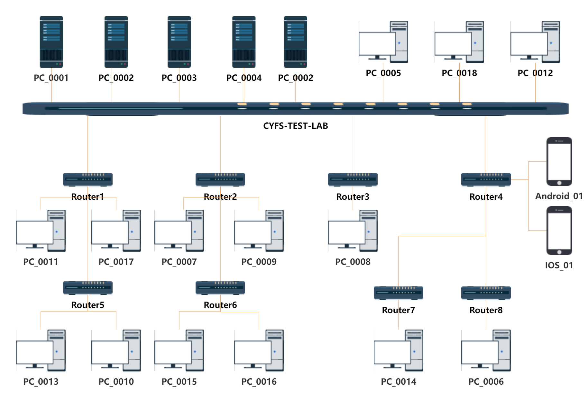
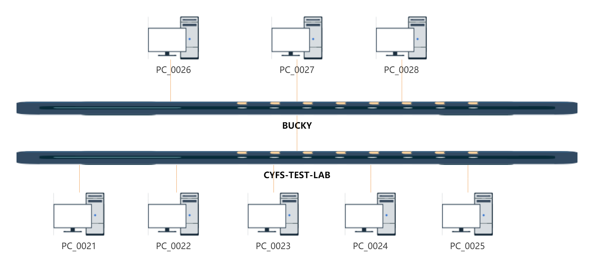

##  cyfs-test-lab BDT and Nighlty

| Agent	 |   Tags	                     |  Router	       | NAT	  | IP 					            | OS		          | 	    Remote Connecttion 	| Port/ID |
| ---------- | ---------------------------   | ---------------- | ---------------------| ----------------------------------------- | ------------------------| --------------------------- |-------------|
| PC_0001    |   Test Server	             |  CYFS-Test-LAB   | pubic                | 192.168.200.175            		| Ubuntu22                | ssh           	|	 10024       |
| PC_0002    |   SN1		                 |  CYFS-Test-LAB   | pubic                | 192.168.200.238              		| CentOS8.3               | ssh          	|	 10022       |
| PC_0003    |   SN2/PN2	                 |  CYFS-Test-LAB   | pubic                | 192.168.200.207            		| Ubuntu20.04             | ssh           	|	 10026       |
| PC_0004    |   SN3/PN1		             |  CYFS-Test-LAB   | pubic                | 192.168.200.181             		| CentOS8.5               | ssh           	|	 10027       |
| PC_0005    |   Agent&Zone1_OOD             |  CYFS-Test-LAB   | pubic                | 192.168.200.161             		| CentOS8.5               | ssh           	|    10025       |
| PC_0006    |   Agent&Zone1_Standby_OOD     |  Router8         | Symmetric            | 10.1.1.236             			| Ubuntu 20.04            | ssh          	|    30024       |
| PC_0007    |   Agent&Zone1_Device1         |  Router2         | Port Restricted Cone | 10.1.2.189             		    | Windows10               | rustdesk        |    201993053   |
| PC_0008    |   Agent&Zone2_Standby_OOD     |  Router3         | Symmetric            | 10.1.1.199             			| Ubuntu20.04             | ssh           	|    30026       |
| PC_0009    |   Agent&Zone2_Device1         |  Router2&Router3 | pubic                | 10.1.1.132|10.1.2.131   		    | Windows10               | rustdesk        |    214467966   |
| PC_0010    |   Agent&Zone1_Device2         |  Router5         | Port Restricted Cone | 192.168.10.137              		| Windows11               | rustdesk        |    206963849   |
| PC_0011    |   Agent&Zone3_Standby_OOD1    |  Router1         | Full Cone            | 192.168.1.109             		    | Ubuntu20.04             | ssh           	|    30022       |
| PC_0012    |   Agent&Zone2_OOD	         |  CYFS-Test-LAB   | pubic                | 192.168.200.133            		| Debian11                | ssh          	|    30028       |
| PC_0013    |   Agent&Zone3_Standby_OOD2    |  Router1&Router5 | Full Cone            | 192.168.1.182|192.168.10.171		| Ubuntu22                | ssh          	|    30027       |
| PC_0014    |   Agent&Zone4_OOD             |  Router7         | Symmetric            | 192.168.1.139             		    | Windows10               | rustdesk        |    216618654   |
| PC_0015    |   Agent&Zone3_Device2         |  Router6         | Port Restricted Cone | 192.168.1.145             		    | Windows7                | rustdesk        |    204963422   |
| PC_0016    |   Agent&Zone2_Device2         |  Router6         | Port Restricted Cone | 192.168.1.109             		    | Windows11               | rustdesk        |    204675181   |
| PC_0017    |   Agent&Zone4_Device1         |  Router1&Router6 | Full Cone            | 192.168.1.177	                    | Windows10               | rustdesk        |    212214302   |
| PC_0018    |   Agent&Zone3_OOD             |  CYFS-Test-LAB   | pubic                | 192.168.200.151	                | Ubuntu 22.04            | ssh           	|    10028       |

##  cyfs-test-lab Beta

| Agent	 |   Tags	                     |  Router	       | NAT	  | IP 					            | OS		          | 	    Remote Connecttion 	| Port/ID |
| ---------- | ---------------------------   | ---------------- | ---------------------| ----------------------------------------- | ------------------------| --------------------------- |-------------|
| PC_0021    |   Zone2_Runtime4	             |  CYFS-Test-LAB   | Port Restricted Cone | 192.168.200.14            		| Windows10               | rustdesk           |	 258475756      |
| PC_0022    |   Zone1_Standby_OOD           |  CYFS-Test-LAB   | Port Restricted Cone | 192.168.200.12            		| Ubuntu22.04             | ssh                |	 40012       |
| PC_0023    |   Zone2_Runtime3              |  CYFS-Test-LAB   | Port Restricted Cone | 192.168.200.16           		| Windows10               | rustdesk           |	 258477155      |
| PC_0024    |   Zone1_Runtime1              |  CYFS-Test-LAB   | Port Restricted Cone | 192.168.200.18           		| Windows10               | rustdesk           |	 258476951      |
| PC_0025    |   Zone1_OOD                   |  CYFS-Test-LAB   | Port Restricted Cone | 192.168.200.13            		| Ubuntu22.04             | ssh                |  40013       |
| PC_0026    |   Zone2_OOD                   |  BUCKY           | Port Restricted Cone | 192.168.100.249             	| Ubuntu22.04             | ssh                |  22          |
| PC_0027    |   Zone1_Runtime2              |  BUCKY           | Port Restricted Cone | 192.168.100.83              	| Windows10               | ssh                |  258477131      |
| PC_0028    |   dec_app server              |  BUCKY           | Port Restricted Cone | 192.168.100.18             	| Windows10               | rustdesk           |             |
